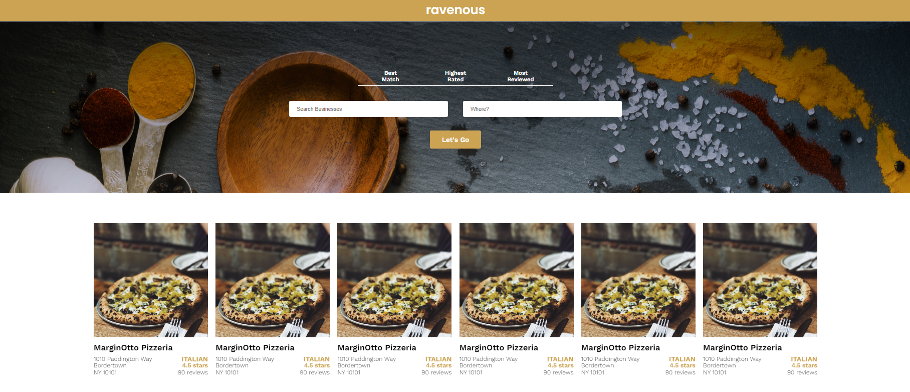

# Ravenous - Restaurant Search App

A client-side React application, utilizing the Yelp API to search for local businesses.

[You Can See the Project Here](https://kubilayture-ravenous-app.netlify.app/)

## Features

- Search for restaurants
- View a list of restaurants returned by the Yelp API
- Sort through restaurants using a filter

## List of Some Potential Features Will Be Added:

- Make addresses clickable and have them open the address in Google Maps in a new tab
- Make images clickable and have them open the business’ website in a new tab
- Clicking on a different sorting option automatically requeries the Yelp API, rather than having to manually click “Let’s Go” again
- Implement your own type of sort (for example, by entering a distance or radius from a central location)
- Allow you to search by pressing “Enter” (or “Return”) on your keyboard, as opposed to manually clicking
- Add autocompletion of addresses to the “Location” input

